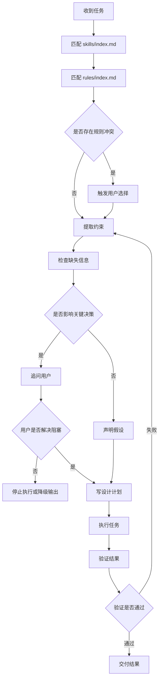

# 测试新架构脚本
## 描述
这个脚本用于测试新的脚本执行器架构是否正常工作。它模拟了一个长时间运行的任务，包含进度报告和错误处理功能。

```mermaid
flowchart TD
    A[收到任务] --> B[匹配 skills/index.md]
    B --> C[匹配 rules/index.md]
    C --> D{是否存在规则冲突}
    D -->|是| E[触发用户选择]
    D -->|否| F[提取约束]
    E --> F
    F --> G[检查缺失信息]
    G --> H{是否影响关键决策}
    H -->|是| I[追问用户]
    H -->|否| J[声明假设]
    I --> K{用户是否解决阻塞}
    K -->|否| L[停止执行或降级输出]
    K -->|是| M[写设计计划]
    J --> M
    M --> N[执行任务]
    N --> O[验证结果]
    O --> P{验证是否通过}
    P -->|通过| Q[交付结果]
    P -->|失败| F
```